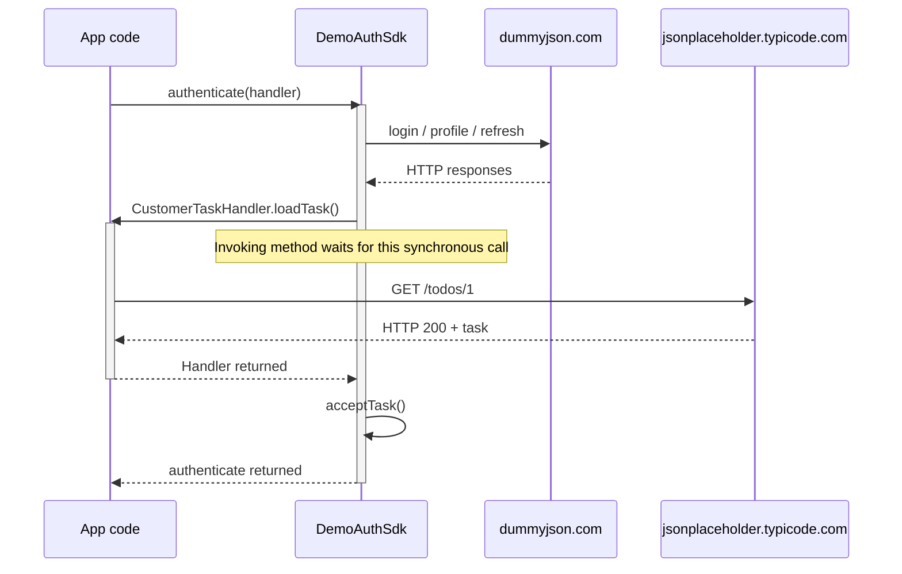

# SDK → app handler → SDK control flow

Handlers are local method invocations. They do not require an HTTP request, server, or transport adapter. The app supplies a handler to the SDK; the SDK invokes it while its own operation remains active. The handler can execute local code and instrument zero or more HTTP calls. Its observed method exit supplies the return or exception-unwind boundary.



This is a conceptual diagram. Individual HTTP exchanges and durations come from imported records, never from this illustration. The later receipt request to httpbin is omitted here for clarity.

## Format 1.1

Existing `operation.started` / `operation.ended` events represent the call; there is no fake HTTP event or separate duplicate span. `span_id` identifies this particular invocation, including repeated calls to the same handler. The start contains:

```json
{
  "name": "CustomerTaskHandler.loadTask",
  "origin": { "owner": "integrator", "component": "CustomerTaskHandler", "method": "loadTask" },
  "invocation": {
    "kind": "handler",
    "dispatch": "synchronous",
    "caller": { "owner": "sdk", "component": "DemoAuthSdk", "method": "authenticate" }
  }
}
```

These are the `data` fields, inside the usual event envelope. `context.parent_span_id` points to the calling SDK operation, when instrumented. Its `trace_id`, `recording_id`, and session remain unchanged. The handler's `origin` is the callee; `invocation.caller` is the immediate caller, not the top-level business-flow initiator. A parentless handler observation is allowed when the caller's span is unavailable; explicit caller metadata still identifies the handoff.

On method exit, the same span emits `operation.ended.data`:

```json
{ "outcome": "success", "completion": "returned", "duration_ns": "125000000", "error": null }
```

| completion | outcome | Meaning for GUI |
| --- | --- | --- |
| `returned` | `success` | Normal method return to caller; not a claim that the returned business value is positive |
| `threw` | `error` | Exception unwinds to caller; caller may catch it and continue successfully |
| `cancelled` | `cancelled` | Observed cancellation exit; visually distinct from normal return |
| `observation_stopped` | `unknown` | Capture stopped without observing method exit; never draw a confirmed return |
| No end event | Unknown/unfinished display state | Partial recording or still running; never infer a return |

`threw` requires error details; error messages are sanitized. Observation stop retains the reason in `extensions["capture.observation_stop_reason"]` and does not claim an application failure. `duration_ns` is elapsed method lifetime, including nested HTTP or waiting; it is neither CPU time nor exclusive SDK time.

The enclosing SDK operation stays open during the synchronous handler. A known handler completion must precede its known caller completion. Nested HTTP requests use the handler context as their parent and retain their actual app executor. If a handler launches asynchronous work and returns early, that HTTP span may outlive the handler. Its causal parent does not extend the method's lifetime. The caller operation represents one invocation, not every thread inside the SDK.

A recording uses one exact schema version throughout. The Kotlin recorder now writes **1.1**. The validator reads both **1.0** and **1.1**; older 1.0 files retain their original interpretation. Handler fields and unknown operation outcomes are rejected in 1.0. A generic 1.0 method block lacks an explicit handler caller/return boundary: a viewer must not invent that metadata.

## Kotlin SDK integration

```kotlin
// App constructs the SDK with its handler implementation.
val sdk = DemoAuthSdk(session, DemoAuthSdk.TaskHandler { handlerContext ->
    // Existing app code; context links any manually recorded requests to this handler.
    customerClient.loadTask(handlerContext)
})

// At the SDK's actual call boundary:
val task = session.invokeHandler(
    name = "CustomerTaskHandler.loadTask",
    caller = Actor("sdk", "DemoAuthSdk", "authenticate"),
    handler = Actor("integrator", "CustomerTaskHandler", "loadTask"),
    parent = authenticateOperation.context
) { handlerContext ->
    suppliedHandler.loadTask(handlerContext)
}
// A returned event has been written; normal SDK execution resumes here.
```

`invokeHandler` executes the application function exactly once, outside the recorder lock, and preserves the returned object or original thrown exception. It does not serialize arguments or return values, send HTTP, change executors, or create new threads. A failure in the event sink does not prevent the application handler from running. Method error details use an unknown stage rather than claiming a network failure.

For manually managed observation use `Session.startHandler(...)` and the returned handle's `returned()`, `threw(error)`, `cancelled(error?)`, or `stopObservation(reason)`. Exactly one terminal event is retained. A method scope ending due to recording shutdown emits observation-stopped rather than an invented return. Calls made after recording has ended can still execute application code; no new records are written.

The current invocation dispatch is **synchronous**. Do not wrap an asynchronous enqueue operation and call its later completion a synchronous method return. A future async handoff/suspend-resume design needs explicit dispatch and continuation events; the GUI must not guess those from timestamps, thread IDs, or HTTP completion. Explicit immutable contexts already allow nested HTTP work on a different thread.

## GUI requirements

- Keep local **App code** and **SDK** participants distinct, in addition to dynamically discovered server-origin lanes. Label components/methods within those roles, with optional component expansion. A handler with no HTTP still renders both its call and return.
- Draw a local call arrow from `invocation.caller` to `origin` at handler start. Label the handler name and distinguish the arrow from HTTP traffic.
- Render the handler activation block on the app side, nested by span relationships. Its caller stays open; indicate that this particular synchronous call is waiting, without implying that the whole SDK or device is idle.
- Draw the observed return/unwind at handler end using the same span ID and explicit completion. Use a dashed return line and outcome badge; use a distinct error/cancel marker for exceptional exits. Do not infer a returned value from the outcome.
- Nest app-owned HTTP under the handler and send its arrows from the app side. When a child outlives the method, retain the causal link and let its visual extent continue beyond the block.
- Keep returned, threw, cancelled, observation-stopped, and missing-end states distinguishable. Unknown/missing exits have an open/faded block, with no normal return arrow.
- Click call, block, or return to open the same invocation inspector: caller/callee, name, trace/span/parent IDs, session/recording, start/end, duration, outcome/completion, sanitized error, capture limitations, and child requests. Arguments and return payloads display **not captured**, not `{}` or invented content.
- Provide separate handler and HTTP counts/filters. In HTTP-only view retain collapsed handler ancestry so the request's execution owner remains apparent. Use event sequence within a recording; do not reorder causal boundaries based on rounded wall time.

## Evidence and handoff

- [Live successful capture](samples/live/successful-sign-in.ndjson): handler calls JSONPlaceholder, returns, then `DemoAuthSdk.acceptTask` executes.
- [Handler with HTTP](examples/handler-http.ndjson), [no HTTP](examples/handler-no-http.ndjson), [throw caught by SDK](examples/handler-throw.ndjson), [cancellation](examples/handler-cancelled.ndjson), [stopped observation](examples/handler-stopped.ndjson), [missing end](examples/handler-interrupted.ndjson): deterministic fixtures.
- [Claude design-spec update prompt](docs/claude-handler-design-prompt.md): ready to paste into the design task. The web sequence viewer itself is not implemented in this repository yet.
