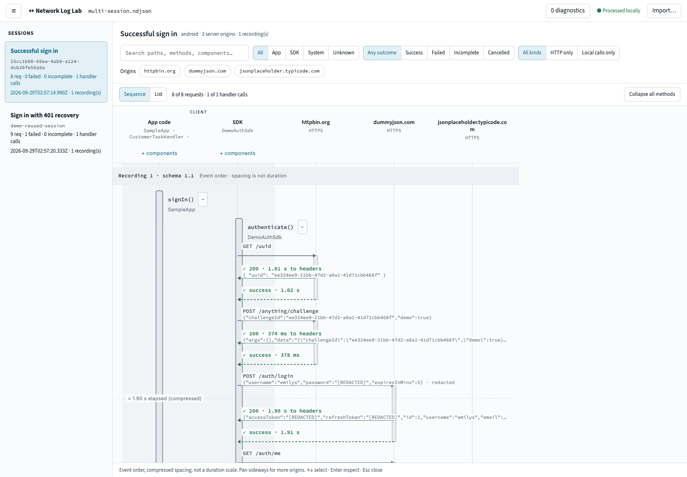
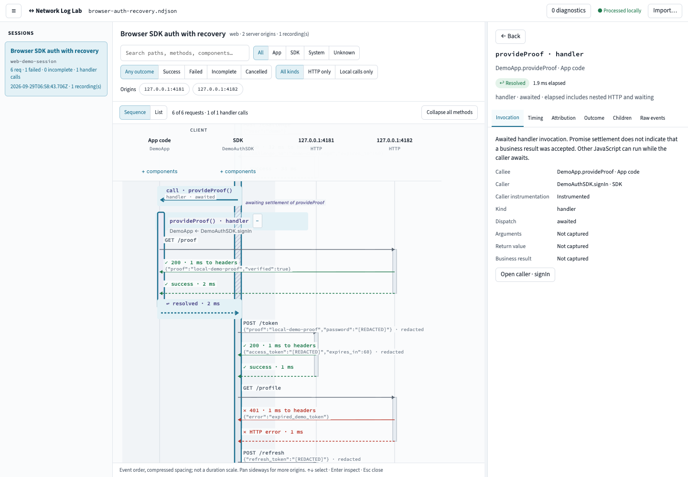
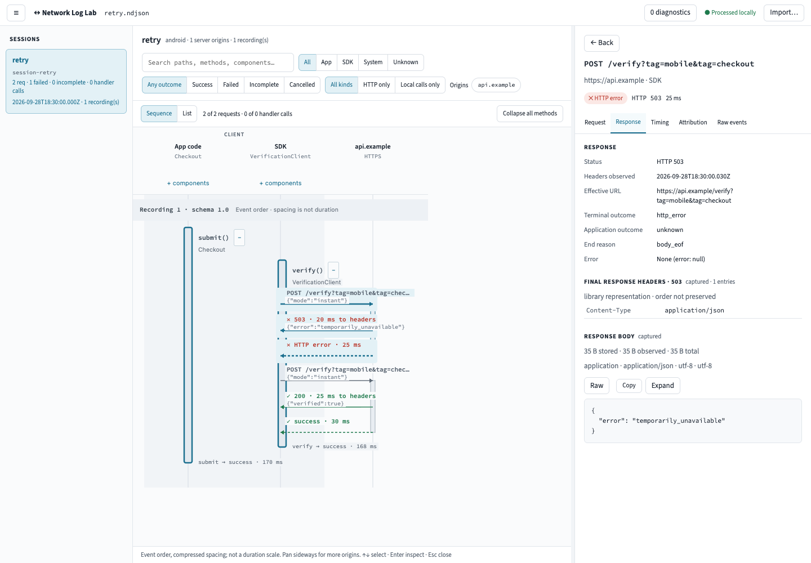
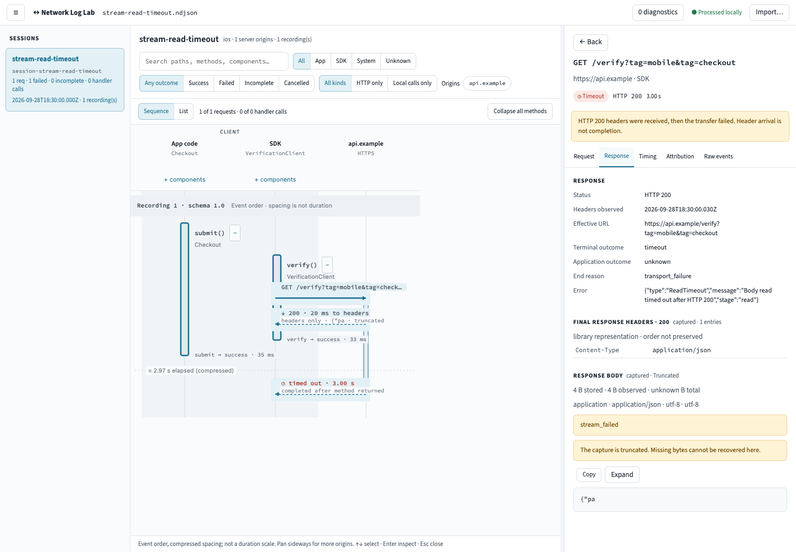

# HTTP sequence logger

Draft **1.2** capture format (reader also accepts **1.0/1.1**) for mobile and browser development SDKs. Includes Kotlin Android and browser recorders with auth samples, a Swift transfer package and manually instrumented iOS demo, a local desktop collector, and an interactive web sequence viewer.

Repository: [patjackson52/http-sequence-logger](https://github.com/patjackson52/http-sequence-logger) · [MIT license](LICENSE).

## FOR AGENTS

Start with **[AGENTS.md — agent directions](AGENTS.md)**, then the [existing-app integration guide](docs/integration/README.md). These identify the implemented SDK APIs, JSON specs, log locations, connection commands and production-build boundaries. The [full agent prompt](docs/integration/AGENT-PROMPT.md) supplies more detail.

**Copy and paste this into your coding agent while it is working in your app's repository:**

```text
Integrate https://github.com/patjackson52/http-sequence-logger into this app's
development builds and connect real captures to its local sequence viewer.

Read the logger repository's AGENTS.md and docs/integration/README.md, then the
relevant platform guide, TRANSPORT.md and SPECS.md. Inspect this app, infer its
platform and HTTP clients, and pin the source revision. Support existing/custom
HTTP clients, manual observations and SDK → app handler → SDK tracing. Production
should retain only the small logging abstraction/no-op; exclude recorder and
transfer implementations and their dependencies/resources.

Use the documented automatic streaming setup for our app and open
http://127.0.0.1:4319/ without a token URL. For Android, target our actual debug
application ID; the android:live command installs the repository sample. Follow
the explicit iOS pairing or browser relay/upload instructions where applicable.
The iOS package transfers sanitized events; implement an app-owned capture adapter
if needed.

Exercise a real app flow, validate its sanitized NDJSON, inspect the live diagram,
check reconnect recovery and audit our shipping build. Document the source
revision, exact log locations, start/reconnect/export commands and verification
results. Ask only for missing information that blocks the work.
```

To try the repository sample before integrating an app, use the quick start below.

## Stream logs into the viewer

For the Android sample, install Node **22.12+**, JDK **17**, Android SDK Platform **35** and platform-tools. Connect a phone with USB debugging authorized, or start an API 26+ emulator. In a new checkout:

```sh
git clone https://github.com/patjackson52/http-sequence-logger.git
cd http-sequence-logger
npm ci
npm run android:live
```

If you already have a checkout, run the last two commands from its root. This builds the viewer and debug app, selects the single connected phone in preference to emulators (or the sole emulator), installs the app, pairs USB, opens **[the live viewer](http://127.0.0.1:4319/)** and runs a sign-in. No serial, pairing JSON or special viewer URL is needed in the common case. Leave the collector terminal running.

Choose one startup command for your workflow, after `npm ci`:

| Workflow | Command from the logger checkout |
| --- | --- |
| Build/install/run the Android sample | `npm run android:live` |
| Exercise the sample's 401/refresh/retry flow | `npm run android:live -- --recovery` |
| Stream from the already installed Android sample | `npm start` |
| Stream from your instrumented Android debug app | `npm run collector -- --android YOUR_APPLICATION_ID --open` |
| Use an iOS or browser producer | `npm start -- --no-android`, then follow [its transfer route](docs/integration/TRANSPORT.md#select-the-device-route) |
| Import files without a live collector | `npm run viewer` — serves the file viewer at port `4173` |

The streaming commands build the viewer automatically. For ambiguous Android device selection, append `-- --device SERIAL` to `npm run android:live`, or add `--device SERIAL` after the existing `--` in other commands. [Additional options and tool discovery](android/README.md#build-and-run) cover custom SDK paths, ports and directories. `android:live` can reuse the collector for the same directory and port; `npm start` does not start a second instance on an occupied port.

Open **http://127.0.0.1:4319/** normally, including after refresh. The live panel shows collector connection, event count and Android readiness. USB pairing and forwarding recover after reconnect/reinstall. **Follow newest session** follows arrivals until you inspect or filter a session. **Pause live** and file import suspend browser updates; **Resume live** returns to the collector. The collector continues retaining events while the viewer is paused.

Logs remain in the app's private storage and accumulate on the desktop in `artifacts/collector/capture.ndjson`, with multiple sessions per file. **Save capture** downloads that collected NDJSON; **Download SVG** saves the current diagram. Keep private `connection-*.json`, state and TLS files out of shared artifacts. [All log locations and retrieval commands](docs/integration/TRANSPORT.md#where-every-file-lives) · [Connection troubleshooting](docs/integration/TRANSPORT.md#troubleshooting-by-symptom) · [Viewer controls](viewer/README.md).

## Desktop viewer examples

Actual desktop captures of the viewer, using the included sanitized logs. Each server origin has its own lane; selecting a request or local invocation opens its details. Click an image to view it at full size.

### Multi-server sign-in and session navigation

An Android auth flow separates app and SDK calls across three server origins. The sidebar keeps successful and recovered sign-in sessions together. [Source capture](samples/live/multi-session.ndjson).

[](docs/screenshots/desktop-multi-server.png)

### SDK → app callback → SDK

The SDK awaits an app-owned handler that makes an HTTP request. The diagram shows the handoff and settlement; the inspector identifies the caller, callee and awaited dispatch. [Source capture](samples/web/browser-auth-recovery.ndjson).

[](docs/screenshots/desktop-awaited-handler.png)

### HTTP failure followed by retry

A 503 response and a successful retry remain separate exchanges. The response inspector exposes status, headers and the captured error payload. This is a synthetic contract fixture. [Source capture](examples/retry.ndjson).

[](docs/screenshots/desktop-retry.png)

### Headers received, body read fails

HTTP 200 headers do not establish successful completion: a later body-read timeout is visible in the sequence and inspector. This is a synthetic contract fixture. [Source capture](examples/stream-read-timeout.ndjson).

[](docs/screenshots/desktop-body-timeout.png)

[Screenshot sources and refresh command](docs/screenshots/README.md) · [Viewer controls](viewer/README.md)

## Run the browser sample

```sh
npm ci
npm run web:sample
```

Open `http://127.0.0.1:4180`. The simulated auth flow uses two local servers, a small SDK, Fetch, and an SDK-awaited app handler making an XHR request. It includes expected token expiry and refresh; no account is needed. A separate action exercises two public APIs. Export NDJSON from the development panel, or configure its same-origin relay for explicit collector upload.

The [browser SDK](web-sdk/README.md) includes manual customer-client recording, bounded memory/IndexedDB storage, redaction and a small production no-op entry. [Existing frontend integration](docs/integration/WEB.md) explains source installation, build aliases, log locations and delivery. Run `npm run check:web-types` and `npm run check:web-release` for typed consumer and shipping isolation checks. [Real browser captures](samples/web/README.md) · [Browser design](docs/web/PLAN.md) · [Review/evidence](docs/web/REVIEW.md).

## Run the Android sample

See [Android setup and integration](android/README.md). The MIT-licensed sample makes real HTTPS requests to three free public services, records both SDK-owned and manually instrumented app requests, and exports local NDJSON. No service registration is required.

- [Successful live capture](samples/live/successful-sign-in.ndjson): 8 successful requests.
- [Recovered live capture](samples/live/recovered-sign-in.ndjson): 9 requests with an expected 401 followed by refresh/retry.
- [Both sessions in one file](samples/live/multi-session.ndjson).
- [End-to-end verification](E2E.md).
- [Native captures delivered through the collector](samples/transfer/README.md): Android recovery and iOS HTTP/TLS/offline recovery.
- [SDK → app handler → SDK tracing](HANDLER-TRACING.md): local calls, nested HTTP, explicit return/throw/cancel, and incomplete observation.
- [Claude design-spec update prompt](docs/claude-handler-design-prompt.md).

## Start here

- [Contract](CONTRACT.md): event semantics, identity, timing, capture fidelity, and importer behavior.
- [Standalone JSON Schema](schema/event.schema.json): JSON Schema 2020-12 for one event/NDJSON line.
- [Adapter contract](ADAPTERS.md): native wrappers and the client-independent recording API.
- [Customer manual logging](MANUAL-LOGGING.md): required public API, defaults, and Kotlin/Swift integration sketches.
- [Correctness review](REVIEW.md): network, Android, and iOS findings, fixes, and remaining native verification.
- [Production isolation review](docs/RELEASE-REVIEW.md): multi-agent findings and native/build verification.
- [Debug-only Kotlin integration](android/RELEASE.md): small production API, manual logging, R8/ProGuard rules, and binary audits.
- [Example manifest](examples/manifest.json): scenarios, descriptions, and expected summaries.
- [Multi-session capture](examples/multi-session.ndjson): 14 requests, six origins, two sessions, three recording periods.

## Validate locally

Use Node.js 22.12 or later from this directory:

```sh
npm ci
npm run validate
npm test
node validate.mjs /absolute/path/to/capture.ndjson
```

Validation performs JSON Schema checks and additional relationship, timing, body-byte, retry, and outcome checks. Exit code `0` means no detected contradictions; warnings can still identify missing data. Exit code `1` means invalid input; `2` means the CLI was called without a filename.

`interrupted.ndjson` and `handler-interrupted.ndjson` deliberately produce warnings for missing lifecycle ends. The importer preserves those records rather than inventing completion.

## Reference scenarios

| File | Expected behavior |
| --- | --- |
| [success](examples/success.ndjson) | App → SDK → API, HTTP 200; duplicate query parameters and headers retained |
| [direct-integrator](examples/direct-integrator.ndjson) | Generated session ID; request executes in integrator code through a custom adapter |
| [http-error](examples/http-error.ndjson) | HTTP 400 with an inspectable JSON error body |
| [timeout](examples/timeout.ndjson) | No response; null status and unavailable body |
| [retry](examples/retry.ndjson) | HTTP 503, backoff, then HTTP 200 under one successful method operation |
| [concurrent](examples/concurrent.ndjson) | Overlapping iOS requests finish in reverse order; native metrics arrive later |
| [cancelled](examples/cancelled.ndjson) | Cancellation remains distinct from HTTP and transport errors |
| [interrupted](examples/interrupted.ndjson) | Unfinished request and method blocks survive an interrupted recording |
| [redacted-truncated](examples/redacted-truncated.ndjson) | Both capture conditions are visible; partial JSON is retained as text |
| [redirect](examples/redirect.ndjson) | New origin/attempt; redirect response body is unavailable |
| [multi-session](examples/multi-session.ndjson) | Interleaved sessions and a reused external session ID; 12 requests in the resumed session |
| [manual-minimal](examples/manual-minimal.ndjson) | Customer request without method spans or complete metadata |
| [manual-observation-stopped](examples/manual-observation-stopped.ndjson) | Known HTTP status, explicitly unknown transfer outcome |
| [stream-read-timeout](examples/stream-read-timeout.ndjson) | Calling method returns at headers; later body timeout remains a failure |
| [ios-partial-metrics](examples/ios-partial-metrics.ndjson) | Failed TLS phase retains start and null end |
| [ios-logical-transactions](examples/ios-logical-transactions.ndjson) | Multiple native transaction snapshots under one logical task |
| [handler-http](examples/handler-http.ndjson) | SDK → app handler → HTTP → app return → SDK resumes |
| [handler-no-http](examples/handler-no-http.ndjson) | Handler call and return without any HTTP |
| [handler-throw](examples/handler-throw.ndjson) | Handler exception caught by a successful SDK caller |
| [handler-cancelled](examples/handler-cancelled.ndjson) | Cancellation exit stays distinct from normal return |
| [handler-stopped](examples/handler-stopped.ndjson) | Observation stops without claiming method exit |
| [handler-interrupted](examples/handler-interrupted.ndjson) | Missing handler end remains unfinished |

All examples are synthetic. Hosts use reserved `.example` names. Readable event/recording IDs make review easier; real producers should generate collision-resistant IDs. The generated session example uses a UUID.

## Maintain the contract

`scripts/build-schema.mjs` is the authoring source for the standalone JSON Schema. `scripts/build-examples.mjs` generates deterministic NDJSON and the manifest. Consumers can use the generated schema directly without either script or Node.js.

```sh
npm run generate
npm test
```

The tests check generated-file reproducibility, all reference examples, import recovery, and rejection of contradictory records. Modify the authoring sources and regenerate; do not edit generated files independently.

Version `1.1` adds explicit synchronous handler calls and returns; `1.2` adds browser producers and explicitly awaited handler settlement. Older recordings retain their original semantics. SDKs are source-integrated development prototypes, not published production releases. Dependencies and lockfile are scoped to this repository, independent of the surrounding application.

## Interactive viewer

Use [the streaming quick start](#stream-logs-into-the-viewer) for live captures at port `4319`. For file import only, run `npm ci && npm run viewer`, then open http://127.0.0.1:4173. Import NDJSON or open a bundled sample to inspect HTTP exchanges and SDK/app handler calls. **Download SVG** saves the current sequence for sharing or documentation, including lane headings, filters, collapsed methods and selection, with interactive controls omitted. See [viewer setup and controls](viewer/README.md), [design history](docs/design/README.md), and [verification evidence](docs/VIEWER-REVIEW.md).
