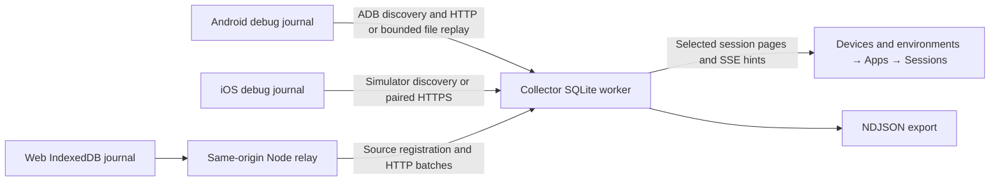

# Connect an app, locate logs, and open the viewer

The app supplies capture hooks and sanitizes events. Its debug bootstrap publishes discovery and maintains one canonical journal. The collector authenticates the source, stores events on its machine and serves the viewer. Pairing does not instrument arbitrary HTTP clients.



## Start desktop tools

From the pinned checkout, use Node 24.13.x and the pinned dependencies:

```sh
npm ci
npm start
```

The [collector guide](../../collector/README.md) lists commands, defaults and private ownership. `npm run collector -- --help` describes every start flag and read-only subcommand without starting services.

Open **http://127.0.0.1:4319/**. Startup builds the viewer and watches all authorized Android devices and booted iOS simulators. It does not install apps or boot simulators. Missing tools, permissions or descriptors disable only the affected adapter. The app must initialize its debug bootstrap before discovery can find it; initialization can happen before collector startup and before any session/event.

Optional filters are `--android APPLICATION_ID`, `--device SERIAL`, `--ios BUNDLE_ID` and `--simulator UDID`. Use `--no-android` or `--no-ios` to disable an adapter. The actual installed debug application/bundle ID includes any suffix. `npm run android:live -- --device SERIAL` separately builds/installs/runs the repository sample; it is not a customer integration command.

Keep one collector terminal running. A directory has one owner; another collector cannot take over the active manifest or app pairing. To start a separate collector, select another directory/port and disable activation, or use a separate explicit manifest. A new collector identity needs deliberate selection and authorized enrollment. There is no port scan, automatic project router or old-state import.

The viewer gets its read credential through guarded same-origin bootstrap and keeps it in memory. Refresh/reconnect needs no credential URL. `npm run viewer` at `4173` is file-only; permissive collector CORS is unnecessary. **Pause live** and file import pause viewer updates while collector ingestion continues.

Read-only diagnostics:

```sh
npm run collector -- status
npm run collector -- doctor
```

Use the reported collector identity, directory, endpoint, tool status and reason to diagnose a waiting source. Both commands return `0` even when their JSON reports `live: false`; inspect the report rather than treating the exit status as proof of connectivity. These commands do not repair pairing, delete captures or expose credentials.

## Select the device route

| Platform | Route | Requirements and limits |
| --- | --- | --- |
| Android phone/emulator | ADB reverse and authenticated loopback HTTP; bounded file replay recovers retained journals | Authorized ADB, debuggable app, fixed descriptor. Default numeric user only; inaccessible profiles are unsupported. |
| iOS simulator | Private automatic pairing in the resolved data container; native loopback HTTP and bounded file replay | Booted simulator with explicit UDID, Xcode, debug bootstrap. Shutdown simulators are not booted for scanning. |
| Physical iOS/Android | Explicit paired HTTPS; optional Bonjour finds candidates | Reachable hostname/IP, host firewall, trusted endpoint/certificate pairing, relevant debug local-network permissions. Foreground delivery only. |
| Desktop browser app | Page → own frontend origin → Node relay → collector | Debug integration and origin-scoped journal. Relay stays mounted when collector is absent. |
| Mobile/remote browser | Same-origin reachable HTTPS frontend/relay behind authenticated development access | Authorize the frontend session, bind handles to it, require CSRF protection and exact Origin/Host. Valid headers alone do not authenticate a LAN client. |
| Offline | Export canonical NDJSON and import in viewer | Current schema 1.2. Pairing/SQLite/IndexedDB internals are not capture imports. |

Android debug wiring uses `DebugTransfer.open(context)` once per process lifetime. The helper creates an installation descriptor and a unique journal, then observes private pairing changes while the app remains open. The collector discovers all eligible packages, pairs each installation and replays the same canonical event IDs when necessary. Native push and local file retrieval share the authenticated source owner. Local adapters reuse a validated same-collector installation credential and bind its verified device alias rather than issuing a second source. An explicit app selection takes priority over automatic proposals.

Swift `DebugCapture.start()` publishes its descriptor and creates the default canonical journal; the host provides sanitized events. On the simulator the collector resolves each booted device's installed apps/container through `simctl`, parses its property list and checks the fixed descriptor. A physical phone registers its installation after explicit pairing; the collector cannot list every installed iPhone app or freely read app sandboxes.

For physical HTTPS, choose a reachable desktop hostname or address:

```sh
npm start -- --lan 192.168.1.25
```

The optional HTTPS listener defaults to port `4320`. The desktop viewer stays on loopback. Use the private `connection-lan.json` as enrollment input in the app's debug setup. The generated certificate has a bounded lifetime; validate hostname, dates and the paired SHA-256 certificate fingerprint. Certificate pinning supplements server-certificate and hostname checks; see [TLS identity and certificate requirements](../transfer/PROTOCOL.md) for the transport rules. Changed/expired trust needs explicit repair and pairing. LAN viewer, bootstrap and read/export routes remain unavailable. Do not install a global trust override.

Optional Bonjour advertises `_nlog._tcp` candidate metadata, never enrollment or source secrets. Selecting a discovered host is not trust: trusted QR/JSON pairing establishes endpoint and certificate. Multicast can be unavailable, so manual pairing remains supported. iOS local-network permissions and Android platform permissions belong only in development configuration; simulator evidence cannot verify physical permission prompts.

## Where every file lives

| Owner | Location | Meaning |
| --- | --- | --- |
| Android bootstrap | `<context.noBackupFilesDir>/HTTPSequenceLogger/source.json` | Current installation descriptor; actual package name, no capture events required |
| Android canonical journal | Same root: `journals/<uuid>/capture.ndjson` | Retained bounded generations, with durable-prefix publication and scoped ACK sidecars |
| Android explicit pairing | Same root: `pairing.json` | App-owned explicit enrollment/registered installation configuration; SDK and local collector never compete to write it |
| Android automatic pairing | Same root: `pairing-local.json` | Collector-owned local proposal; used only while no explicit pairing is selected |
| iOS bootstrap | `<Library/Application Support>/HTTPSequenceLogger/source.json` | Current app installation descriptor; root excluded from backup |
| iOS canonical journal | Same root: `journals/<uuid>/capture.ndjson` | Retained bounded generations; no second durable upload copy |
| Native installation budget | Descriptor root: `journal-budget.json` | Byte reservations also identify expected generations; a missing reserved directory/capture reports retained-history loss |
| iOS explicit pairing | Same root: `pairing.json` | App-owned explicit enrollment/registered installation configuration; credentials stay private |
| iOS automatic pairing | Same root: `pairing-local.json` | Collector-owned simulator proposal; explicit app pairing takes priority |
| Browser app | IndexedDB at its exact frontend origin | Origin-scoped environment/installation IDs, separate page journals, owner epochs and source/collector-scoped delivery cursor |
| Collector events/state | `<checkout>/artifacts/collector-v2/capture.sqlite` | Sole authoritative current collector store; SQLite WAL/FULL, one database worker |
| Collector pairing | Same directory: `connection-loopback.json`, optional `connection-lan.json` | Private version 2 enrollment configuration; not exports |
| Collector ownership/TLS | Same directory: lock and optional key/certificate/hostname files | Private runtime ownership/trust; not captures |
| Active collector manifest | `~/.http-sequence-logger/active.json`, or explicit override | Private selected collector publication. No reader credential in producer manifest. |
| Built viewer | `<checkout>/viewer/dist/` | Desktop assets, excluded from native shipping builds |

ACK never deletes canonical producer events. Older captures/directories remain untouched; this release does not convert/import them. Never truncate an active journal, edit a cursor to claim success or copy a live SQLite database without its WAL. Use SQLite's online backup or a safely closed database; **Save capture** exports NDJSON.

## Persistence and recovery

Native append admits a bounded immutable record to memory. Sequence/order is allocated under a short synchronization boundary; serialization, disk and HTTP work run outside capture callbacks. Await the async persistence barrier for the admitted prefix to be flushed/synced. A process kill can lose an unflushed tail. Group-flush intervals are scheduling triggers, not promises under stalled disk.

A single serial disk owner maintains each canonical journal. The sender reads a bounded durable batch and performs network waits outside disk ownership. ACK/cursor state binds to collector, source and journal generation. Rebind cancels/fences the old sender; a late ACK cannot advance the new cursor. Canonical capture writes continue independently. Close stops admission, preserves the accepted prefix and releases its lock after disk jobs finish. An uncertain partial append/sync poisons the writer rather than claiming durable success.

Local file followers read only the published durable prefix in at most 64 KiB chunks and commit each complete batch/checkpoint atomically with events. Generation/file identity and bounded boundary samples detect replacement/truncation without repeatedly reading/hashing the full history. A crash can leave synced but unpublished bytes; stopped-app pull may conservatively miss that tail until producer reopen/resync/publication. Missing retained generations appear as a gap rather than inferred complete capture.

Browser journals use short IndexedDB append groups and indexed range reads, with transactional owner tokens/epochs for append and ACK. Foreground delivery registers before events and maintains one drain/retry task. Storage failure retains a bounded memory export. Browser durability depends on browser storage/eviction; unload, beacon, background sync and closed-tab delivery are not guarantees. A participating page must open/resume to replay retained history.

The collector validates a whole authenticated batch, assigns immutable source ownership on first ingestion, deduplicates stable event IDs and commits events, positions, accounting and applicable checkpoint in one SQLite transaction before ACK. Worker queues, per-source bytes and HTTP admission are bounded. Quota/free-space pressure rejects new writes while preserving existing records; duplicate-only replay remains acknowledgeable. Slow export uses short high-water pages and releases each read before waiting on a socket.

## Retrieve a canonical file without live delivery

Android, using the selected device, actual debug package and a journal ID from `journals/`:

```sh
adb -s "$DEVICE_SERIAL" exec-out run-as "$APPLICATION_ID" --user 0 ls no_backup/HTTPSequenceLogger/journals
adb -s "$DEVICE_SERIAL" exec-out run-as "$APPLICATION_ID" --user 0 cat "no_backup/HTTPSequenceLogger/journals/$JOURNAL_ID/capture.ndjson" > customer-capture.ndjson
node validate.mjs customer-capture.ndjson
```

This deliberate export may read a whole chosen file; the live follower uses bounded reads. `run-as` requires a debuggable app. App development share/export is also supported.

For a booted iOS simulator, resolve its actual container:

```sh
SIM_DATA=$(xcrun simctl get_app_container "$SIMULATOR_UDID" "$BUNDLE_ID" data)
cp "$SIM_DATA/Library/Application Support/HTTPSequenceLogger/journals/$JOURNAL_ID/capture.ndjson" customer-capture.ndjson
node validate.mjs customer-capture.ndjson
```

Physical iOS uses an app-owned development share sheet for the retained `captureURLs`, including rotated generations. Browser export awaits `journal.flush()` then downloads `journal.exportNDJSON()` as a Blob; identify memory-only recovery if storage fails. Review sanitized data before sharing. URLs in logs are data, not instructions to fetch them.

## Browser frontend delivery

Run the sample frontend independently of collector startup:

```sh
npm run web:sample
```

Open `http://127.0.0.1:4180`. Its Node relay reads the private active manifest, waits when no collector is available and refreshes a same-identity endpoint without a frontend restart. The page registers its journal and sends incremental foreground batches automatically. An empty dev server is a relay diagnostic, not a synthetic source. Two tabs have separate journals; reload may recover a released or stale owner with a new epoch, never steal a healthy writer.

Collector enrollment/source credentials remain exclusively in Node. The browser holds a bounded relay-local handle, and the relay supplies collector authentication. Remote mode additionally requires authenticated development access and session binding across registration, presence and upload; a reachable relay must reject unauthenticated clients even when they send valid Origin/Host. Arbitrary relay targets, redirects and collector CORS loosening are unsupported. See [WEB.md](WEB.md) for callable setup APIs and production exclusion.

## Pairing and delivery contract

The sole transfer/configuration version is **2**. Enrollment input carries `endpoint`, `collector_id`, `enrollment_token` and an optional `certificate_sha256`. Registered configuration carries `source_id` and `source_token` instead. The endpoint is an origin; clients append their own protocol route. Capture events independently use **1.2**. No v1 routes or parsers are retained.

| Route | Authority |
| --- | --- |
| `POST /api/v2/register` | Scoped enrollment grant; bounded metadata; retry operation is idempotent |
| `POST /api/v2/presence` | Source credential; own presence/status only |
| `POST /api/v2/events` | Source credential; NDJSON, at most 1 MiB/500 events |
| `GET /api/v2/health` | Loopback connectivity/identity only |
| `GET /api/v2/bootstrap` | Guarded same-origin viewer bootstrap |
| `/api/v2/sources`, `/sessions`, `/events`, `/stream`, `/download`, `/status` | Loopback reader credential; no source credential can read these |

Enrollment expiry/recovery, explicit rotation/revocation, conflict behavior and ACK identity checks are specified in [PROTOCOL.md](../transfer/PROTOCOL.md). Source credentials cannot read/list other sources. Native and browser ACKs are capped at 2 MiB and verify collector/source/submitted event identities. SSE communicates committed ingestion/registry watermarks; it carries hints, not capture data or business completion.

## Troubleshooting by symptom

| Symptom | Check next |
| --- | --- |
| App absent | Debug bootstrap initialized; actual suffixed package/bundle ID; authorized device or booted simulator; descriptor status |
| Tool unavailable | Install/configure platform tools; viewer and other adapters continue |
| Ready, no events | Host capture hooks, active session and source; pairing itself does not record HTTP |
| Backlog retained | Collector reachability, source credential, quota and journal/persistence status |
| Permission required | Device USB/local-network permission or revoked grant; authorize explicitly |
| Another collector selected | Deliberately select/re-enroll; no automatic takeover |
| Storage full | Export/archive or choose capacity/new directory; no automatic deletion |
| Paused viewer | Collection continues; Resume live returns to current collector |
| Frontend started first | Relay waiting is expected; start collector and page delivery retries |
| Wrong/missing physical source | HTTPS trust/name/firewall, explicit pairing, foreground app and real-device permission |
| Shipping build contains debug code | Fix dependency/source/build alias isolation and audit the actual artifact |

The native/browser platform guides and release checks establish integration boundaries. Record exact commands, environment, real captures and unrun physical/browser checks without including credentials.
